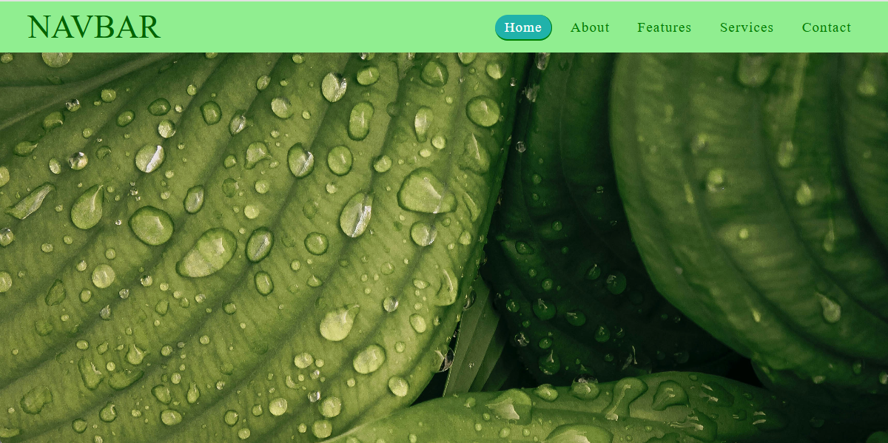
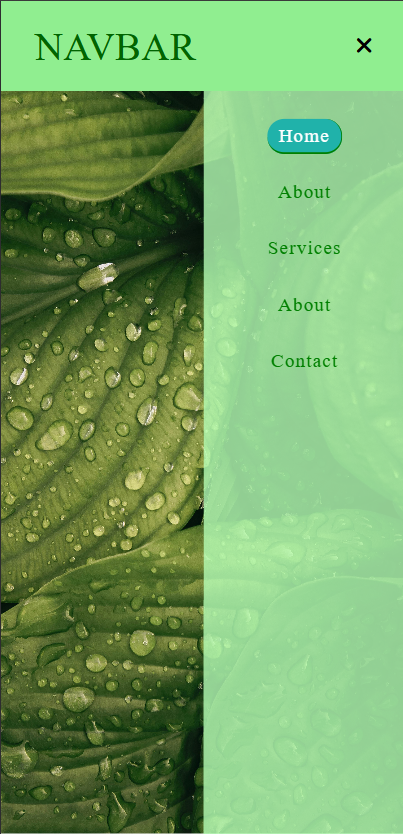

# 🌿 Responsive Navbar using HTML & CSS

This is a simple and elegant **Responsive Navigation Bar** mini project built with **HTML5** and **CSS3**. The navbar is mobile-friendly and includes a toggle menu icon for smaller screens using only CSS (no JavaScript).

## 📸 Preview (Desktop , Mobile)

 
 

## 🔧 Features

- ✅ Fully responsive design
- ✅ CSS-only hamburger menu for mobile view
- ✅ Smooth hover effects and transitions
- ✅ Background image with fixed attachment
- ✅ Font Awesome icons integration

## 🛠️ Technologies Used

- HTML5
- CSS3
- Font Awesome (via CDN)

## 💡 How It Works

- The navigation bar is styled using Flexbox for alignment.
- Media queries handle responsiveness below `700px` screen width.
- A hidden checkbox (`#click`) is used to toggle the mobile menu via CSS.

## 📂 Project Structure

